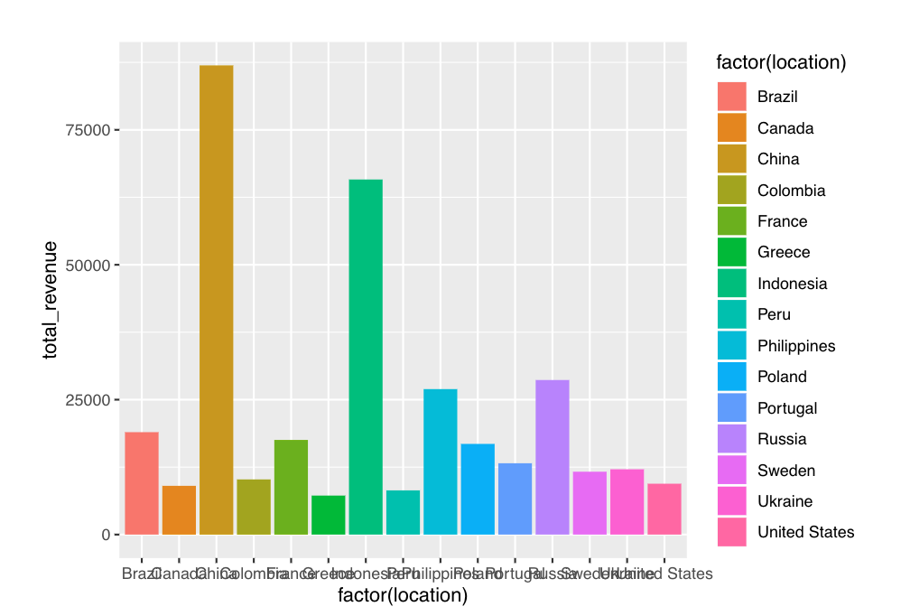

# Solution : Mistplay Data Engineer Take Home Challenge 


## Data Preprocessing Object - Python 
[DataPrepocessor.py](https://github.com/AymenRumi/DataEngineerTakeHomeChallenge/blob/master/Solution/DataPrepocessor.py) contains code for the data processing object used for [Mistplay Data Engineering Challenge](https://github.com/Mistplay/DataEngineerTakeHomeChallenge).

This `object` will be called to process data according to Mistplay requirements.
This object may be used to process any dataset that adhere to proper file format(JSON & Parquet).

Futher methods may be added to deal with future data processing needs

Code below contains the `template` for the preprocessor object

```python

# Template for Data Preprocessing Object

class DataPrepocessor:
        
  def __init__():            # initializes object 
                                
  def importData():          # import data into object
  
  def printColumnNames():    # print data columns         
  
  def countDuplicates():     # count duplicate data entries in a given column      
  
  def removeDuplicates():    # remove duplicate entries in a given column
      
  def addRank():             # add rank for numerical column
  
  def anonymizeColumn():     # encrypt a column
  
  def decryptColumn():       # decrypt an encrypted column 
  
  def decryptEntry():        # decrypt ecnrypted data entry
  
  def invertedIndex():       # create inverted index table
  
  def saveData():            # save dataset
  
  def JSONtoParquet():       # convert JSON to parquet
  
  def getEncryptionKeys():   # return encryption keys for encrypted columns
  
  def getData():             # return data

```

The [code](https://github.com/AymenRumi/DataEngineerTakeHomeChallenge/blob/master/Solution/DataPrepocessor.py) follows `object oriented design` standard and is meant to be continuously used for future data preprocessing.

With focus on:
1. `Maintainability`
2. `Reusability`
3. `Robustness`
4. `Scalability` (PySpark Dataframe may be needed for Big Data Processing)
               
## Solution - Jupyter Notebook 

[Mistplay Data Engineer Take Home Challenge.ipynb](https://github.com/AymenRumi/DataEngineerTakeHomeChallenge/blob/master/Solution/Mistplay%20Data%20Engineer%20Take%20Home%20Challenge.ipynb) contains solution to Misplay Data Engineering Challenge for Task 1 - Task 6.

`DataPrepocessor` object is called and initialized 

```python
# initialization

from DataPrepocessor import DataPrepocessor

# importing data

preprocessor=DataPrepocessor("https://raw.githubusercontent.com/Mistplay/DataEngineerTakeHomeChallenge/master/data.json")
```

1.  Task - `Removing Duplicates`
```python

# method called

preprocessor.removeDuplicates('id')
preprocessor.removeDuplicates('created_at')
```


2. Task - `Compute the Rank by Group`
```python

# method called

preprocessor.addRank('user_score', 'sub_group_rank',group_by='age_group')
```


3. Task - `Flattening & Extracting List`
```python

widget_name=[]
widget_amount=[]

for list in (preprocessor.getData()['widget_list']):
    for i in range(len(list)):
        widget_name.append(list[i]['name'])
        widget_amount.append(list[i]['amount'])
df = pd.DataFrame({'widget_name':widget_name,'widget_amount':widget_amount})
```

[JSON file](https://github.com/AymenRumi/DataEngineerTakeHomeChallenge/blob/master/Solution/flattened_widget.json) for Task 3 table

4. Task - `Anonymize Column, & Decrypt Entry`
```python

# methods called

preprocessor.anonymizeColumn('email')
preprocessor.decryptEntry(anonymous_email,'email_anon')
preprocessor.decryptColumn('email_anon')
```
[JSON file](https://github.com/AymenRumi/DataEngineerTakeHomeChallenge/blob/master/Solution/preprocessed_Data.json) for Processed Data from Task 1,2,4

5. Task - `Inverted Index Table`
```python

# method called
preprocessor.invertedIndex('location','id',"inverted_indexTable")
```

[JSON file](https://github.com/AymenRumi/DataEngineerTakeHomeChallenge/blob/master/Solution/inverted_indexTable.json) for Task 5 table

## Data Analysis - R

Extra work done on the [data.json](https://github.com/Mistplay/DataEngineerTakeHomeChallenge/blob/master/data.json) file

[MistplayDatasetAnalysis.pdf](https://github.com/AymenRumi/DataEngineerTakeHomeChallenge/blob/master/Solution/MistplayDatasetAnalysis.pdf) contain `Data Visualization` and `Summary Statistic` analyzed with `R`

Example of `Total Revenue by Location`




